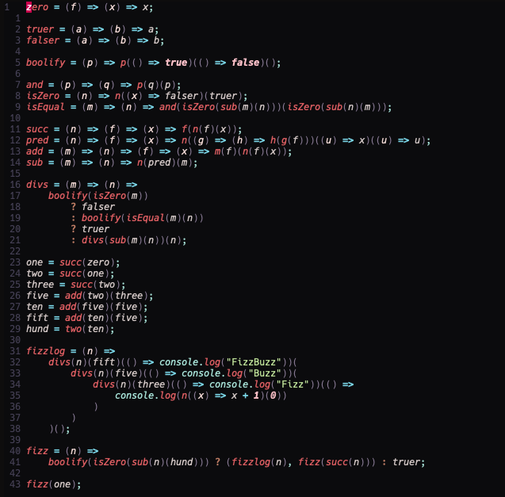

# nvim-lychee

- Colour semantics inspired by https://github.com/catppuccin/nvim
- In progress

## Demo



## Usage

### Vim-plug

```
Plug 'krleitch/nvim-lychee'
```

### init.vim

```
lua << EOF
local lychee = require("lychee")
-- configure it
lychee.setup(<settings>)
EOF
```

### Settings

```
transparent_background = false,
term_colors = false,
styles = {
	comments = "italic",
	functions = "italic",
	keywords = "italic",
	strings = "NONE",
	variables = "italic",
},
integrations = {
	treesitter = true,
	native_lsp = {
		enabled = true,
		virtual_text = {
			errors = "italic",
			hints = "italic",
			warnings = "italic",
			information = "italic",
		},
		underlines = {
			errors = "underline",
			hints = "underline",
			warnings = "underline",
			information = "underline",
		},
	},
  alpha = false,
  leap = false,
	lsp_trouble = false,
	cmp = true,
	lsp_saga = false,
	gitgutter = false,
	gitsigns = true,
	telescope = true,
	nvimtree = {
		enabled = true,
		show_root = false,
		transparent_panel = false,
	},
	neotree = {
		enabled = false,
		show_root = false,
		transparent_panel = false,
	},
	which_key = false,
	indent_blankline = {
		enabled = true,
		colored_indent_levels = false,
	},
	dashboard = true,
	neogit = false,
	vim_sneak = false,
	fern = false,
	barbar = false,
	bufferline = true,
	markdown = true,
	lightspeed = false,
	ts_rainbow = false,
	hop = false,
	notify = true,
	telekasten = true,
	symbols_outline = true,
}
```
